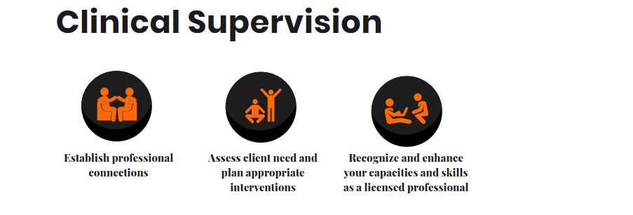

*EN*

Lex was one of my favourite clients I've worked with. In order to promote his services, he asked that I built him an engaging website with a modern, engaging design. You can see some examples of this work right here in this post.

*FR*

Lex était l'un de mes clients préférés avec qui j'ai travaillé. Afin de promouvoir ses services, il m'a demandé de lui créer un site web attrayant avec un design moderne et engageant. Vous pouvez voir quelques exemples de ce travail ici dans ce post.

*PT*

Lex foi um dos meus clientes favoritos com quem trabalhei. Para promover seus serviços, ele pediu que eu construísse um site atraente com um design moderno e envolvente. Você pode ver alguns exemplos deste trabalho aqui neste post.

---

*EN*

I designed this visual to communicate the key elements of Clinical Supervision in a clear and engaging manner. The title "Clinical Supervision" is prominently displayed in a bold font, immediately informing the viewer of the subject matter. Each of the three main points is accompanied by a simple, orange icon that visually represents the concept, helping in quick recognition and understanding. Below each icon, there is concise text that succinctly explains the associated concept, ensuring the message is conveyed without overwhelming the viewer. The use of orange for the icons draws attention, and the black background for the icons contrasts well with the white background, ensuring readability and visual appeal. The balanced layout, with evenly spaced and aligned points, creates an organized and aesthetically pleasing design. This professional and clean style is appropriate for the context of clinical supervision, balancing professionalism with approachability for the intended audience of licensed professionals.

*FR*

J'ai conçu ce visuel pour communiquer les éléments clés de la supervision clinique de manière claire et engageante. Le titre "Supervision Clinique" est affiché en évidence dans une police en gras, informant immédiatement le spectateur du sujet. Chacun des trois points principaux est accompagné d'une icône simple et orange qui représente visuellement le concept, aidant à la reconnaissance et à la compréhension rapide. Sous chaque icône, un texte concis explique succinctement le concept associé, garantissant que le message est transmis sans submerger le spectateur. L'utilisation de l'orange pour les icônes attire l'attention, et le fond noir pour les icônes contraste bien avec le fond blanc, assurant lisibilité et attrait visuel. La disposition équilibrée, avec des points espacés et alignés de manière égale, crée un design organisé et esthétiquement plaisant. Ce style professionnel et épuré est approprié pour le contexte de la supervision clinique, équilibrant professionnalisme et accessibilité pour le public cible des professionnels agréés.

*PT*

Eu projetei este visual para comunicar os elementos-chave da Supervisão Clínica de forma clara e envolvente. O título "Supervisão Clínica" é exibido de forma proeminente em uma fonte em negrito, informando imediatamente o espectador sobre o assunto. Cada um dos três pontos principais é acompanhado por um ícone simples e laranja que representa visualmente o conceito, ajudando no reconhecimento e compreensão rápida. Abaixo de cada ícone, há um texto conciso que explica sucintamente o conceito associado, garantindo que a mensagem seja transmitida sem sobrecarregar o espectador. O uso de laranja para os ícones chama a atenção, e o fundo preto para os ícones contrasta bem com o fundo branco, garantindo legibilidade e apelo visual. O layout equilibrado, com pontos espaçados e alinhados de maneira uniforme, cria um design organizado e esteticamente agradável. Este estilo profissional e limpo é apropriado para o contexto da supervisão clínica, equilibrando profissionalismo com acessibilidade para o público-alvo de profissionais licenciados.

---

*EN*

This design effectively showcases a collection of poetry books with an elegant and clean layout. The prominent "Poetry" title clearly indicates the section, while each book is displayed with its cover art, title, and artist credit, providing a visually appealing and informative presentation. The navigation arrows and pagination dots allow for easy browsing, enhancing the user experience. For more details and to explore the entire collection, please see more by clicking the button below, directing you to the full page.

*FR*

Ce design met efficacement en valeur une collection de livres de poésie avec une mise en page élégante et épurée. Le titre "Poésie" en évidence indique clairement la section, tandis que chaque livre est affiché avec sa couverture, son titre et son crédit d'artiste, offrant une présentation visuellement attrayante et informative. Les flèches de navigation et les points de pagination permettent une navigation facile, améliorant l'expérience utilisateur. Pour plus de détails et pour explorer toute la collection, veuillez voir plus en cliquant sur le bouton ci-dessous, vous dirigeant vers la page complète.

*PT*

Este design mostra de forma eficaz uma coleção de livros de poesia com um layout elegante e limpo. O título "Poesia" em destaque indica claramente a seção, enquanto cada livro é exibido com sua arte da capa, título e crédito do artista, proporcionando uma apresentação visualmente atraente e informativa. As setas de navegação e os pontos de paginação permitem uma navegação fácil, melhorando a experiência do usuário. Para mais detalhes e para explorar toda a coleção, veja mais clicando no botão abaixo, direcionando-o para a página completa.****

